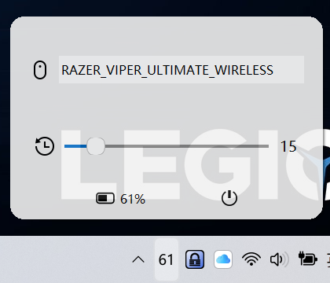

<h1 align="center">   Rebt</h1>

A simple system tray to display the Razer mouse battery.

You can specify the mouse and adjust the frequency of battery updates using the slider.



## For user

The exe or zip file can be downloaded directly from the [release ](https://github.com/Maasea/razerBattery/releases) page.

exe: small but slower startup

zip: faster startup but  bigger

**Note**: 

- All the file require 64-bit system, but you can build 32-bit files by referring to the `For dev`
- Configuration file directory: `user/username/rebt.ini`
- To enable it to start with windows, place the file or a shortcut in the startup folder

### Configuration

```
[DEFAULT]
interval = [0-120] 
traystyle = [0,1]
scale = [seconds, minutes]
name = Mouse Name
usbid = USB ID
tranid = xxxx
```

## For dev

1. You need download [libusb](https://libusb.info/), and put `libusb-1.0.dll` in the project's root directory.

2. If you want to build 32-bit file, please install 32-bit `python`

3. Install python dependencies

   ```python
   pip install -r requirements.txt
   ```

4. Build

   ```python
   pip install pyinstaller
   ```

   ```python
   # Build to folder
   pyinstaller folder.spec 
   # or build to OneFile
   pyinstaller oneFile.spec
   ```

**Note**: You can get more detailed information by reading  [razer-mouse-battery-windows](https://github.com/hsutungyu/razer-mouse-battery-windows).

## Credit

This project is dependent on  [razer-mouse-battery-windows](https://github.com/hsutungyu/razer-mouse-battery-windows).

## Troubleshooting

All tests are based on **Razer Viper Ultimate Wireless**

You can delete the config file to reset Rebt.
